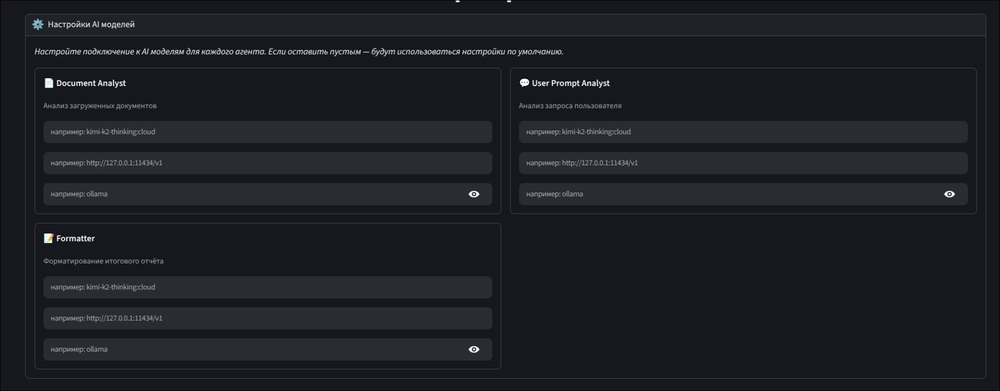
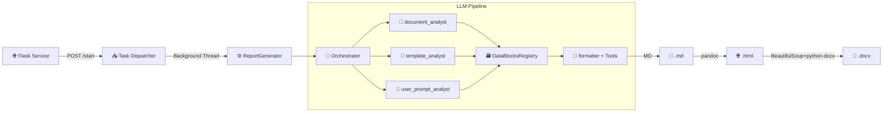
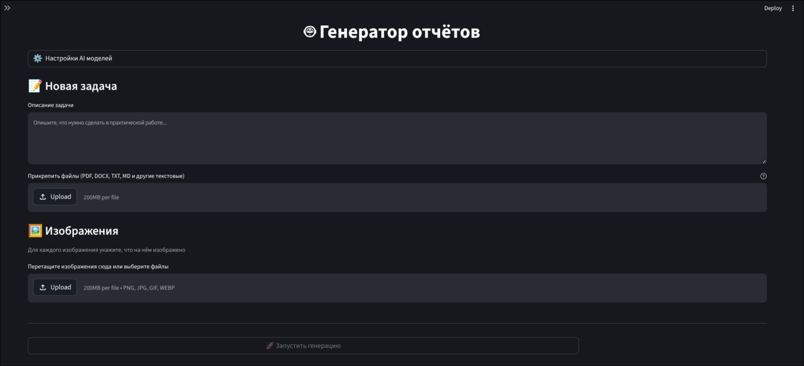

# 📄 ReportsGen

> Автоматическая генерация отчётов по практическим и лабораторным работам. Бросаешь документы, шаблоны, требования и картинки — получаешь готовый отчёт в Word. Всё на базе умных ИИ-агентов.


---

## 🤔 Зачем это нужно?

В колледже мне приходится тратить большое кол-во времени на написание и оформление отчетов по лабам и практикам. ReportsGen решает эту проблему: кидаешь все материалы в систему, и она сама разбирает, что к чему, и собирает отчёт.

Проект построен на Flask с асинхронной обработкой, использует несколько ИИ-агентов для анализа документов параллельно, а результат конвертирует в Markdown → HTML → DOCX с сохранением всех стилей.

**🎉 Теперь с новым UI на Streamlit!**
- ✨ AI-генерация описаний к изображениям
- 🎨 Улучшенный пользовательский опыт
- 🔄 Простая разработка новых функций

> В будущем планируется создать инструменты для ИИ агента, с помощью которых он мог бы напрямую писать docx отчет, без лишних конвертаций из одного типа файла в другой.




---

## 🏗️ Как это работает внутри

Система построена как конвейер: Flask принимает запросы, кидает задачу в фон, и там начинается магия с ИИ.



### 🔄 Что происходит шаг за шагом
1. **Загрузка** — Кидаешь файлы, шаблон, текст требований и картинки через веб-интерфейс или API.
2. **Анализ параллельно** — Три ИИ-агента разбирают документы, шаблон и требования одновременно в отдельных потоках, вытаскивая нужную инфу в виде блоков данных.
3. **Сбор данных** — Всё сохраняется в реестре блоков, сериализуется в JSON для удобства.
4. **Сборка отчёта** — Финальный агент читает блоки по запросу, генерит Markdown и завершает работу.
5. **Конвертация** — Безопасно превращаем MD в HTML, потом в DOCX, сохраняя стили, таблицы и экранируя код.

---

## 🤖 Команда ИИ-агентов

У каждого агента своя специализация, чтобы не путаться в задачах.

| Агент | Модель | Что делает |
|-------|--------|------------|
| `document_analyst` | `kimi-k2-thinking:cloud` | Разбирает документы, вытаскивает факты, код и данные |
| `template_analyst` | `kimi-k2-thinking:cloud` | Смотрит на шаблон, понимает структуру и требования к оформлению |
| `user_prompt_analyst` | `kimi-k2-thinking:cloud` | Читает твои требования, даже если они неявные |
| `formatter` | `qwen3.5:cloud` | Собирает всё в финальный отчёт с помощью инструментов |

💡 Модели можно менять на любые совместимые с OpenAI API — Ollama, vLLM, LiteLLM, что угодно.

### 🔧 Настройка моделей

В интерфейсе есть раздел «Настройки AI моделей», где для каждого агента можно указать:
- Модель (типа `gpt-4o` или `qwen3.5:cloud`)
- Base URL API (например, `http://127.0.0.1:11434/v1`)
- API Key для аутентификации

Если ничего не указать — берутся глобальные настройки из конфига.



---

## ⚡ Что умеет

| Фишка | Зачем |
|-------|-------|
| 🔹 **Многоагентная оркестрация** | Анализирует документы, шаблоны и требования параллельно |
| 🔹 **Инструменты для форматтера** | `read_block` для чтения данных по кускам, `finish` для завершения |
| 🔹 **Безопасная конвертация** | Экранирует код перед MD→HTML, чтобы ничего не сломалось |
| 🔹 **Rate Limiting** | Не спамит API, ждёт между запросами |
| 🔹 **Асинхронность** | Всё в фоне, интерфейс не тормозит |
| 🔹 **Гибкий экспорт** | Получаешь Markdown, HTML и стилизованный DOCX с заголовками, таблицами и кодом |
| 🔹 **Логирование** | Structlog пишет JSON-логи с трассировкой и таймингами |
| 🔹 **Кастомные модели** | В интерфейсе можно настроить модели, ключи и URL для каждого агента |

---

## 🛠️ Что под капотом

- **Язык:** Python 3.13
- **Зависимости:** Poetry
- **Веб:** Flask 3.1+
- **ИИ:** OpenAI-compatible API (Ollama, etc.)
- **Промпты:** Jinja2 через PromptManager
- **Документы:** python-docx, pypdf, pandoc, LibreOffice
- **Параллелизм:** ThreadPoolExecutor и threading
- **Качество:** mypy, Black, isort, pytest

---

## 🚀 Установка и запуск

### 1. Системные зависимости
```bash
# Ubuntu/Debian
sudo apt install pandoc libreoffice-core

# macOS
brew install pandoc libreoffice
```

### 2. Клонирование и установка
```bash
git clone https://github.com/paranoik1/ReportsGenerator
cd ReportsGenerator
poetry install --no-root
```

### 3. Настройка (.env) - опционально
Создай `.env` в корне с таким содержимым:

```bash
# Настройки ИИ
LLM_BASE_URL=http://127.0.0.1:11434/v1/
LLM_API_KEY=YOUR_API_KEY
LLM_TIMEOUT=200

# Ограничение скорости
RATE_LIMIT_DELAY=10
```

### 4. Запуск Ollama
```bash
ollama pull kimi-k2-thinking:cloud
ollama pull qwen3.5:cloud
ollama serve
```

### 5. Запуск приложения

**Вариант A: Новый Streamlit UI (рекомендуется)**

Терминал 1 - Backend:
```bash
poetry run python src/service.py
```

Терминал 2 - Frontend:
```bash
poetry run streamlit run src/streamlit_app.py --server.port 8501
```

Открывай `http://localhost:8501` в браузере.

**Вариант B: Классический Flask UI**

```bash
poetry run python src/service.py
```

Открывай `http://127.0.0.1:5000` в браузере.

---

## 🌐 API и как пользоваться

### 📤 Запуск генерации
```bash
curl -X POST http://127.0.0.1:5000/start \
  -F "prompt=Сделай отчёт по лабе №3" \
  -F "files=@source.pdf" \
  -F "template=@template.docx" \
  -F "image_0=@screenshot.png" \
  -F "desc_0=График U(I)"
```
Получишь: `{"task_id": "a1b2c3d4-..."}`

### 🔧 С кастомными моделями
```bash
curl -X POST http://127.0.0.1:5000/start \
  -F "prompt=Отчёт по практике" \
  -F "files=@source.pdf" \
  -F "model_document_analyst=gpt-4o" \
  -F "base_url_document_analyst=https://api.openai.com/v1" \
  -F "api_key_document_analyst=sk-..." \
  -F "model_formatter=o1-preview" \
  -F "base_url_formatter=https://api.openai.com/v1" \
  -F "api_key_formatter=sk-..."
```
Префиксы для агентов: `model_`, `base_url_`, `api_key_` (document_analyst, template_analyst, user_prompt_analyst, formatter)

### 🔍 Статус задачи
```bash
curl http://127.0.0.1:5000/status/<task_id>
```
Ответ: `{"status": "queued"|"done"|"error", "result": "...", "html_result": "/view_html/<id>"}`

### 📥 Скачать результат
| Что | Куда |
|-----|------|
| `GET` | `/view_html/<task_id>` | Посмотреть HTML в браузере |
| `GET` | `/download/<task_id>` | Скачать DOCX |

---

## 📁 Структура проекта

```
ReportsGen/
├── .env                        # Переменные окружения
├── .gitignore                  # Игнорируемые файлы Git
├── mypy.ini                    # Конфигурация MyPy
├── poetry.lock                 # Фиксированные версии зависимостей
├── pyproject.toml              # Конфигурация Poetry и проекта
├── pytest.ini                  # Конфигурация Pytest
├── README.md                   # Документация проекта
├── screenshot.png              # Скриншот интерфейса
├── TODO.md                     # Список задач
├── dataset/                    # Тестовые данные
│   └── user_prompts/           # Примеры пользовательских промптов
├── prompts/                    # Шаблоны системных промптов (.j2)
│   ├── _common/                # Общие шаблоны
│   ├── document_analyst.j2     # Промпт для анализа документов
│   ├── formatter.j2            # Промпт для форматирования отчётов
│   ├── template_analyst.j2     # Промпт для анализа шаблонов
│   └── user_prompt_analyst.j2  # Промпт для анализа промптов
├── src/                        # Исходный код
│   ├── config.py               # Централизованная конфигурация
│   ├── models.py               # Data-классы и модели
│   ├── report_generator.py     # Генерация отчётов (MD→HTML→DOCX)
│   ├── service.py              # Flask-приложение, API, фоновые задачи
│   ├── storage.py              # Управление хранением данных
│   ├── task_worker_pool.py     # Пул рабочих потоков
│   ├── llm/                    # Интеграция с LLM
│   │   ├── __init__.py
│   │   └── rate_limiter.py     # Ограничение скорости запросов
│   ├── orchestrator/           # Оркестратор LLM-агентов
│   │   ├── __init__.py
│   │   ├── analyzer.py         # Анализаторы документов и промптов
│   │   ├── base.py             # Базовый класс оркестратора
│   │   ├── dto.py              # Data Transfer Objects
│   │   ├── formatter.py        # Форматтер с tool-calling
│   │   └── tools.py            # Инструменты для агентов
│   ├── static/                 # Статические файлы
│   │   ├── css/
│   │   │   └── style.css       # Стили интерфейса
│   │   └── js/
│   │       └── app.js          # JavaScript для веб-интерфейса
│   ├── templates/              # HTML-шаблоны
│   │   └── index.html          # Веб-интерфейс
│   └── utils/                  # Утилиты
│       ├── data_block_registry.py  # Реестр блоков данных
│       ├── docx_styles.py      # Стили для DOCX
│       ├── log.py              # Настройка логирования
│       ├── md2docx.py          # Конвертер MD→DOCX
│       └── prompt_manager.py   # Управление промптами
├── tests/                      # Тесты
│   ├── e2e/                    # End-to-end тесты
│   ├── integration/            # Интеграционные тесты
│   └── unit/                   # Модульные тесты
```

---

## 💻 Для разработчиков

```bash
# Тесты
poetry run pytest

# Типизация
poetry run mypy src/

# Форматирование
poetry run black src/
poetry run isort src/
```

---

## 📝 Формат блоков данных

ИИ-агенты возвращают инфу в таком формате:
```
===BLOCK_START===
Короткое описание (1-2 предложения)
Полный контент блока. Код и данные без сокращений.
===BLOCK_END===
```
- `description` — что это такое
- `content` — вся инфа целиком

---

## 🗺️ Что дальше

- [ ] Сохранять прогресс в SQLite
- [ ] Кэшировать запросы к ИИ по хешу документов
- [ ] Улучшить rate limiting для мультипотока
- [ ] Лучше вставлять картинки (обтекание, позиционирование)
- [x] Анализировать изображения с мультимодальными моделями (UI готов, нужна интеграция)
- [ ] Human-in-the-loop для итеративных правок отчёта
- [ ] Прямая генерация DOCX без конвертации через HTML
- [ ] Конструктор стилей документа
- [ ] Docker и docker-compose

---

## 📜 Лицензия

MIT — используй как хочешь.

---

💬 Есть вопросы или идеи? Пиши в Issues или PR.
🙌 Рад, что заглянул в ReportsGen! 🚀
