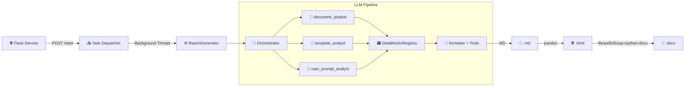

# 📄 ReportsGen

> **Автоматическая генерация отчётов по практическим и лабораторным работам** на основе исходных документов, шаблонов, пользовательских требований и изображений с использованием многоагентного LLM-пайплайна.


---

## 📖 Обзор

`ReportsGen` превращает разрозненные материалы (PDF, DOCX, TXT, скриншоты) и текстовые требования в структурированные отчёты. Проект построен на **асинхронной Flask-архитектуре** с фоновой обработкой задач, пулом потоков для анализа и цепочкой специализированных LLM-агентов. Результат отдаётся в трёх форматах: `Markdown → HTML → DOCX` с сохранением стилей и таблиц.


---

## 🏗️ Архитектура



### 🔄 Пайплайн обработки
1. **Приём задачи** → Файлы, шаблон, промпт и изображения загружаются через Web UI или API.
2. **Параллельный анализ** → 3 агента извлекают структурированные `DataBlock`'и в фоновых потоках.
3. **Регистрация данных** → Блоки сохраняются в `DataBlocksRegistry` и сериализуются в JSON.
4. **Tool-Augmented генерация** → `formatter` читает блоки через `read_block`, формирует Markdown и завершает работу через `finish`.
5. **Конвертация** → Безопасный MD → HTML → DOCX с экранированием кода и применением стилей.

---

## 🤖 LLM-агенты

| Агент | Модель | Задача |
|-------|--------|--------|
| `document_analyst` | `kimi-k2-thinking:cloud` | Извлекает факты, код и данные из исходных документов |
| `template_analyst` | `kimi-k2-thinking:cloud` | Анализирует структуру, требования к оформлению и поля шаблона |
| `user_prompt_analyst` | `kimi-k2-thinking:cloud` | Выделяет явные/скрытые требования пользователя |
| `formatter` | `qwen3.5:cloud` | Генерирует финальный отчёт с использованием инструментов |

> 💡 Модели могут быть заменены на любые OpenAI-совместимые LLM (Ollama, vLLM, LiteLLM и др.).

---

## ⚡ Ключевые возможности

| Функция | Описание |
|---------|----------|
| 🔹 **Многоагентная оркестрация** | Параллельный анализ документов, шаблонов и промптов |
| 🔹 **Инструменты форматтера** | `read_block` (точечный доступ к данным), `finish` (завершение) |
| 🔹 **Безопасная конвертация** | Экранирование `<code>`-блоков перед MD→HTML для предотвращения поломки парсера |
| 🔹 **Rate Limiting** | Встроенный `RateLimiter` с настраиваемой задержкой между запросами к API |
| 🔹 **Асинхронность** | Фоновые потоки на `ThreadPoolExecutor`, неблокирующий API |
| 🔹 **Гибкий экспорт** | `Markdown` → `HTML` → стилизованный `DOCX` (заголовки, таблицы, код, списки) |
| 🔹 **Структурированное логирование** | `structlog` с JSON-выводом, трассировкой задач и замерами времени |

---

## 🛠️ Технологический стек

- **Язык:** Python 3.13
- **Менеджер зависимостей:** `Poetry`
- **Web-фреймворк:** `Flask 3.1+`
- **LLM API:** OpenAI-compatible (Ollama)
- **Шаблоны промптов:** `Jinja2` (`PromptManager`)
- **Обработка документов:** `python-docx`, `pypdf`, `pypandoc`, `pandoc`, `LibreOffice` (`soffice`)
- **Параллелизм:** `concurrent.futures.ThreadPoolExecutor`, `threading`
- **Качество кода:** `mypy`, `Black`, `isort`, `pre-commit`, `pytest`

---

## 📦 Установка и запуск

### 1. Системные зависимости
```bash
# Ubuntu/Debian
sudo apt install pandoc libreoffice-core

# macOS
brew install pandoc libreoffice
```

### 2. Клонирование и окружение
```bash
git clone https://github.com/your-username/reportsgen.git
cd reportsgen
poetry install
```

### 3. Подготовка LLM-бэкенда (Ollama)
```bash
ollama pull kimi-k2-thinking:cloud
ollama pull qwen3.5:cloud
ollama serve
```

### 4. Запуск сервиса
```bash
poetry run python src/service.py
```
Сервис доступен по адресу: `http://127.0.0.1:5000`

> ⚙️ **Конфигурация** задаётся в `Orchestrator.__init__()`: `base_url`, `api_key`, `rate_limit_delay`, `max_parallel_workers`.

---

## 🌐 API и использование

### 📤 Создание задачи
```bash
curl -X POST http://127.0.0.1:5000/start \
  -F "prompt=Составь отчёт по лабораторной работе №3" \
  -F "files=@source.pdf" \
  -F "template=@template.docx" \
  -F "image_0=@screenshot.png" \
  -F "desc_0=График зависимости U(I)"
```
**Ответ:** `{"task_id": "a1b2c3d4-..."}`

### 🔍 Проверка статуса
```bash
curl http://127.0.0.1:5000/status/<task_id>
```
**Ответ:** `{"status": "queued"|"done"|"error", "result": "...", "html_result": "/view_html/<id>"}`

### 📥 Просмотр и скачивание
| Метод | Эндпоинт | Описание |
|-------|----------|----------|
| `GET` | `/view_html/<task_id>` | Просмотр HTML-версии в браузере |
| `GET` | `/download/<task_id>` | Скачивание финального `.docx` |

---

## 📁 Структура проекта

```
ReportsGen/
├── src/
│   ├── service.py              # Flask-роуты, фоновые задачи, API
│   ├── report_generator.py     # Высокоуровневая генерация (MD→HTML→DOCX)
│   ├── orchestrator.py         # Ядро: агенты, RateLimiter, ThreadPool, Tool-calling
│   ├── models.py               # Data-классы: Document, ImageDocument, StateAgents
│   ├── utils/
│   │   ├── md2docx.py          # Конвертеры и безопасная обработка кода
│   │   ├── docx_styles.py      # Настройка стилей DOCX
│   │   ├── data_block_registry.py  # Реестр блоков данных
│   │   ├── prompt_manager.py   # Jinja2-рендеринг промптов
│   │   └── log.py              # Настройка structlog
│   └── templates/
│       └── index.html          # Веб-интерфейс
├── prompts/                    # .j2 шаблоны системных промптов
├── uploads/ & tmp/             # Директории задач (игнорируются git)
├── logs/                       # events.jsonl, journal.log
└── pyproject.toml              # Poetry-конфигурация
```

---

## 💻 Разработка

```bash
# Запуск тестов
poetry run pytest

# Проверка типизации
poetry run mypy src/

# Форматирование
poetry run black src/
poetry run isort src/

# Pre-commit хуки
poetry run pre-commit run --all-files
```

---

## 📝 Формат данных `DataBlock`

Агенты возвращают данные в стандартизированном виде:
```text
===BLOCK_START===
Краткое описание (1-2 предложения)
Полное содержание блока. Код и данные передаются без сокращений.
===BLOCK_END===
```
- `description` — краткая аннотация для контекста
- `content` — полная информация, включая исходный код без `...`

---

## 🗺️ Roadmap

- [ ] Сохранение `state` в SQLite для возобновления прогресса
- [ ] Кэширование LLM-запросов по хешу документов
- [ ] Глобальный `RateLimiter` для многопоточной среды
- [ ] Улучшенная вставка изображений (обтекание, привязка к символу)
- [ ] Мультимодальный анализ пользовательских изображений
- [ ] Docker-контейнеризация и `docker-compose`

---

## 📜 Лицензия

[MIT License](LICENSE) — свободное использование, модификация и распространение.

---
💬 **Вопросы и предложения?** Откройте Issue или Pull Request.  
🙌 Спасибо за интерес к **ReportsGen**! 🚀
